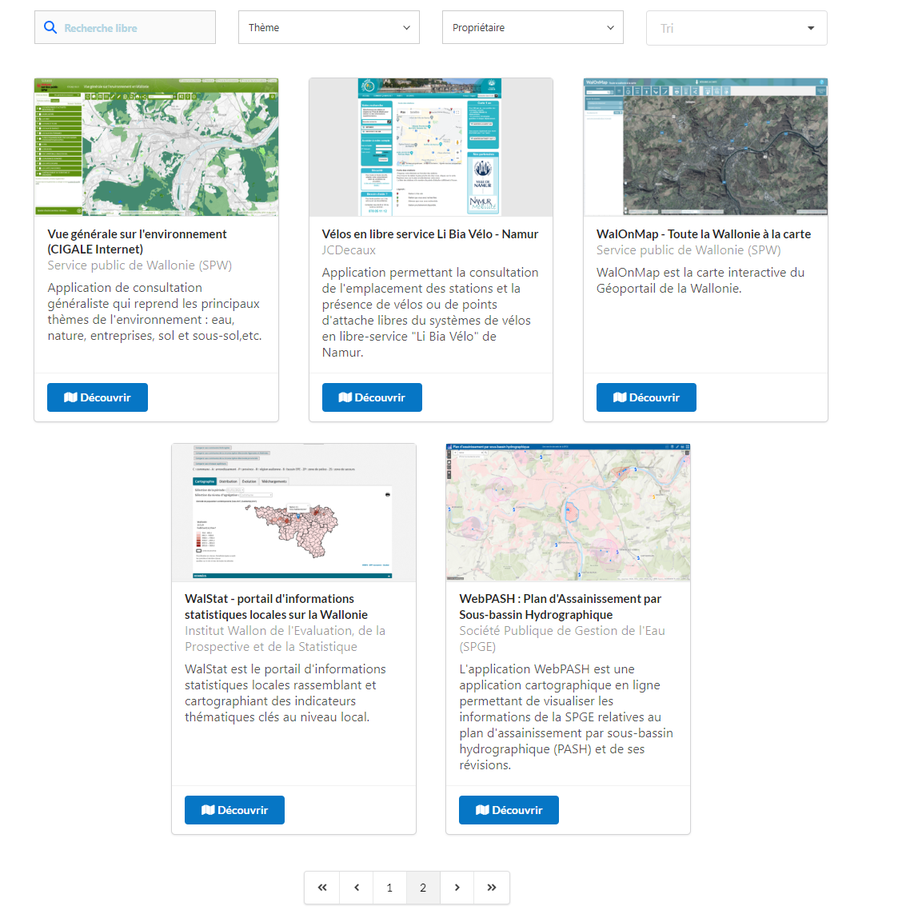
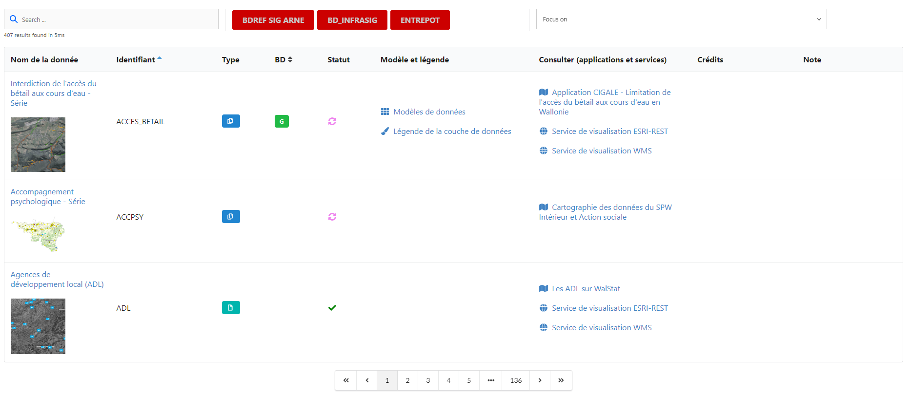

# Composants web à destination des catalogues de métadonnées GeoNetwork

Ces composants web ont été mis en place afin de répondre à divers besoins:
-	Présentation de certaines informations contenues dans le catalogue [GeoNetwork](https://geonetwork-opensource.org/) sous forme diverses (tableaux, cartes de métadonnées,...)
-	Récupération des données depuis l’index [ElasticSearch](https://www.elastic.co) du catalogue [GeoNetwork](https://geonetwork-opensource.org/)
-	Conception dynamique des composants web sur base des champs sélectionnées dans l’index [ElasticSearch](https://www.elastic.co) de [GeoNetwork](https://geonetwork-opensource.org/)
-	Possibilité de recherche, tri et filtre (interactions directes avec [ElasticSearch](https://www.elastic.co))
-	Intégration dans des sites internet externes

Ces composants web ont été créés dans le cadre du projet [METAWAL](https://metawal.wallonie.be/) pour une intégration dans différents sites de la [Région wallonne](https://www.wallonie.be/fr).


## Cartes de métadonnées

Ce composant permet d'afficher les résultats d'une recherche GeoNetwork sous forme d'une liste de cartes de métadonnées. La structure s'inspire des "stores" tels que les "web applications store".

<--->

## Tableau de métadonnées

Ce composant délivre le résultat d'une recherche GeoNetwork sous forme d'un tableau que le gestionnaire peut customiser selon les besoins afin d'améliorer l'expérience utilisateur (définition des champs à visualiser, utilisation d'icônes, introduction de labels, jeu de couleur,...)



# GeoNetwork - limitation de version
Ces composants sont disponibles pour les versions [4.2.0 de GeoNetwork](https://geonetwork-opensource.org/manuals/4.0.x/en/overview/change-log/version-4.2.0.html) et supérieure (utilisation du composant ElasticSearch de GeoNetwork)

# Equipe de développements

- Arnaud De Groof
- François Prunayre
- Vincent Bombaerts
- Marceau Louis

Voir [Github](https://github.com/titellus/icho)

# Financement

Le financement a été assuré par la [Région wallonne](https://www.wallonie.be/fr) dans le cadre de la maintenance de son catalogue de métadonnées [METAWAL](https://metawal.wallonie.be/)
